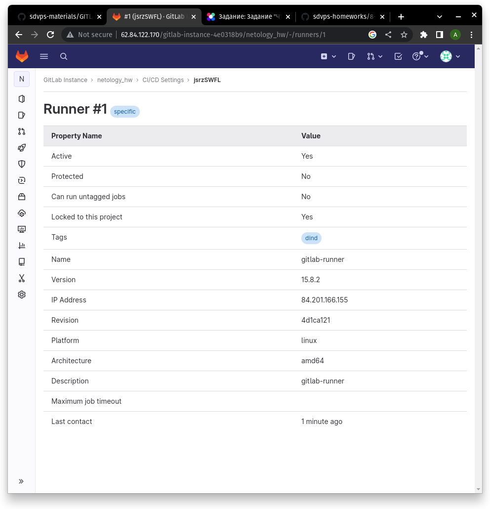
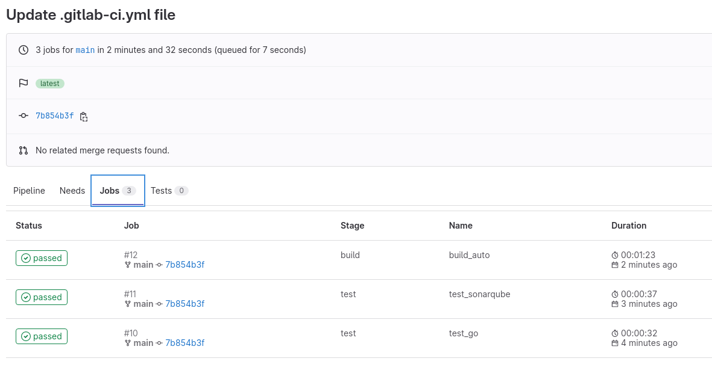

# Домашнее задание к занятию "8.3. GitLab" - `Андрей Сотников`

---

### Задание 1

> 1. Разверните GitLab локально, используя Vagrantfile и инструкцию, описанные в этом репозитории.
> 2. Создайте новый проект и пустой репозиторий в нём.
> 3. Зарегистрируйте gitlab-runner для этого проекта и запустите его в режиме Docker. Раннер можно регистрировать и запускать на той же виртуальной машине, на которой запущен GitLab.  
>
> В качестве ответа в репозиторий шаблона с решением добавьте скриншоты с настройками раннера в проекте.  



---

### Задание 2

> 1. Запушьте [репозиторий](https://github.com/netology-code/sdvps-materials/tree/main/gitlab) на GitLab, изменив origin. Это изучалось на занятии по Git.
> 2. Создайте .gitlab-ci.yml, описав в нём все необходимые, на ваш взгляд, этапы.
>
> В качестве ответа в шаблон с решением добавьте:
>
> * файл gitlab-ci.yml для своего проекта или вставьте код в соответствующее поле в шаблоне;
> * скриншоты с успешно собранными сборками.

``` yaml
stages:
  - test
  - build

test_go:
  stage: test
  image: golang:1.17
  script:
   - go test .

test_sonarqube:
  stage: test
  image:
    name: sonarsource/sonar-scanner-cli
    entrypoint: [""]
  variables:
    SQ_PROJECT: netology-hw
    SQ_HOST: http://51.250.108.111:9000
  script:
    - sonar-scanner -Dsonar.projectKey=$SQ_PROJECT -Dsonar.sources=. -Dsonar.host.url=$SQ_HOST -Dsonar.login=$SQ_TOKEN

build_auto:
  stage: build
  only:
    - main
  image: docker:23
  script:
   - docker build .

build_manual:
  stage: build
  when: manual
  except:
    - main
  image: docker:23
  script:
    - docker build .
```



---

### Задание 3*

> Измените CI так, чтобы:
>
> * этап сборки запускался сразу, не дожидаясь результатов тестов;
> * тесты запускались только при изменении файлов с расширением *.go.
>
> В качестве ответа добавьте в шаблон с решением файл gitlab-ci.yml своего проекта или вставьте код в соответсвующее поле в шаблоне.

Ответ
